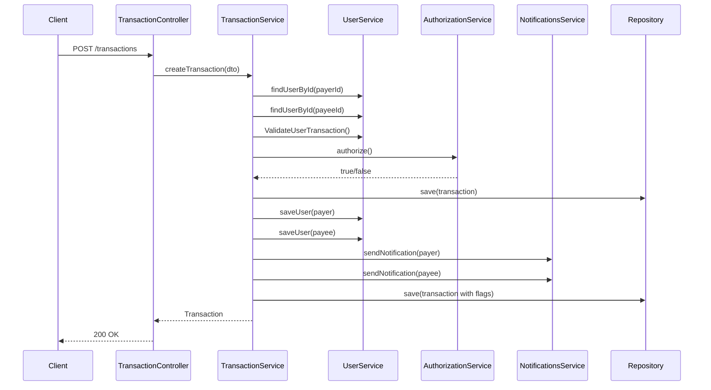

# Simplified Transfer System Spring

Sistema simplificado de transferências bancárias desenvolvido com **Java 17** e **Spring Boot 4.0.2**.

---

## 📋 Sobre o Projeto

Este projeto implementa uma API REST para gerenciamento de usuários e transações financeiras entre contas. O sistema valida regras de negócio, autoriza transações via API externa e envia notificações aos envolvidos.

### Funcionalidades Principais

- **Gestão de Usuários**: criação e listagem de usuários (tipo COMMON ou MERCHANT)
- **Transações**: transferências entre usuários com validação de saldo e tipo de conta
- **Autorização Externa**: validação de transações via API externa com retry
- **Notificações**: envio de notificações aos usuários após conclusão da transação
- **Auditoria**: registro de status de notificações (sucesso/falha) no banco de dados

---

## 🚀 Como Rodar o Projeto

### Pré-requisitos

- **Java 17** ou superior (LTS)
- Maven (o projeto inclui Maven Wrapper)

### Executar a Aplicação

No diretório raiz do projeto, execute:

```bash
./mvnw spring-boot:run
```

A aplicação estará disponível em: **http://localhost:8080**

### Console H2 (Database)

Acesse o console do banco H2 em memória:

- URL: **http://localhost:8080/h2-console**
- JDBC URL: `jdbc:h2:mem:testdb`
- Username: `sa`
- Password: *(deixe em branco)*

---

## 📡 Endpoints da API

### Usuários

#### `POST /users` - Criar usuário
```json
{
  "firstName": "Ana",
  "lastName": "Silva",
  "document": "123.456.789-00",
  "balance": 1500.00,
  "password": "senha123",
  "email": "ana.silva@example.com",
  "userType": "COMMON"
}
```

**Tipos de Usuário:**
- `COMMON`: usuários comuns (podem enviar e receber transferências)
- `MERCHANT`: comerciantes (apenas recebem transferências)

#### `GET /users` - Listar todos os usuários

---

### Transações

#### `POST /transactions` - Criar transação
```json
{
  "payerId": 1,
  "payeeId": 2,
  "value": 100.00
}
```

**Validações:**
- Saldo suficiente no pagador
- Pagador não pode ser `MERCHANT`
- Autorização externa deve aprovar
- Ambos os usuários devem existir

#### `GET /transactions` - Listar todas as transações

---

## 🏗️ Arquitetura e Tecnologias

### Stack Tecnológico

- **Java 17** (LTS)
- **Spring Boot 4.0.2**
- **Spring Data JPA** (persistência)
- **H2 Database** (banco em memória)
- **Lombok** (redução de boilerplate)
- **SLF4J** (logging)
- **RestTemplate** (integração com APIs externas)

### Estrutura de Pacotes

```
com.simplifiedTransferSystemSpring/
├── controllers/          # Camada de apresentação (REST)
├── services/            # Lógica de negócio
├── repositories/        # Acesso a dados (JPA)
├── domain/              # Entidades do domínio
│   ├── user/           # User, UserType
│   └── transaction/    # Transaction
├── dtos/               # Data Transfer Objects
├── infra/              # Configurações e handlers globais
└── exceptions/         # Exceções customizadas
```

---

## 🎯 Princípios SOLID Aplicados

Durante o desenvolvimento, o código foi refatorado para aderir aos **princípios SOLID**:

### 1. **Single Responsibility Principle (SRP)**
Cada classe tem uma única responsabilidade:
- `TransactionService`: orquestra o fluxo de transações
- `UserService`: gerencia usuários e validações de negócio
- `NotificationsService`: envia notificações
- `TransactionRepository` / `UserRepository`: acesso a dados

### 2. **Open/Closed Principle (OCP)**
Classes abertas para extensão, fechadas para modificação:
- Uso de interfaces como `TransactionValidator` e `AuthorizationService`
- Novos validadores ou estratégias de autorização podem ser adicionados sem alterar código existente

### 3. **Liskov Substitution Principle (LSP)**
Implementações concretas podem substituir interfaces sem quebrar comportamento:
- `DefaultTransactionValidator` implementa `TransactionValidator`
- `RestAuthorizationService` implementa `AuthorizationService`

### 4. **Interface Segregation Principle (ISP)**
Interfaces específicas e coesas:
- `AuthorizationService.authorize()`: apenas autorização
- `TransactionValidator.validate()`: apenas validação

### 5. **Dependency Inversion Principle (DIP)**
Dependências de abstrações, não de implementações concretas:
- `TransactionService` depende de `AuthorizationService` (interface), não da implementação REST
- Facilita testes unitários com mocks

---

## 🔨 Refatorações Realizadas

### Melhorias no `TransactionService`

**Antes**: Método `createTransaction` com ~40 linhas, múltiplas responsabilidades.

**Depois**: Extraídos métodos privados auxiliares:
- `loadUser()`: carrega usuário por ID
- `validateTransaction()`: valida regras de negócio
- `buildTransaction()`: constrói entidade Transaction
- `updateBalancesAndSave()`: atualiza saldos e persiste
- `authorizeTransaction()`: autoriza via API externa
- `parseAuthorizationResponse()`: interpreta resposta da API

**Benefícios:**
- ✅ Métodos menores e mais testáveis
- ✅ Maior coesão e separação de conceitos
- ✅ Facilita manutenção e extensão
- ✅ Melhor rastreamento com logging (substituído `System.out.println` por `Logger`)

### Separação de Responsabilidades

Foram criadas novas abstrações:
- **`AuthorizationService`**: interface para serviços de autorização
- **`RestAuthorizationService`**: implementação com retry e parsing de resposta
- **`TransactionValidator`**: interface para validação de transações
- **`DefaultTransactionValidator`**: implementação delegando ao `UserService`
- **`TransactionAssembler`**: construção de entidades Transaction

---

## 🔐 Regras de Negócio

1. **Validação de Saldo**: pagador deve ter saldo suficiente
2. **Restrição de Tipo**: `MERCHANT` não pode enviar transferências
3. **Autorização Externa**: integração com `https://util.devi.tools/api/v2/authorize`
   - Retry automático (até 3 tentativas)
   - Backoff exponencial entre tentativas
4. **Notificações**: envio assíncrono via `NotificationsService`
5. **Auditoria**: flags `payerNotified` e `payeeNotified` persistidos

---

## 🧪 Testes

### Executar Testes Unitários
```bash
./mvnw test
```

### Testes Manuais (HTTP Requests)

Os arquivos em `apit-test/` contêm requisições HTTP prontas:
- `user.http`: criação e listagem de usuários
- `transactions.http`: cenários de transações (sucesso, falhas, validações)

Use extensões como **REST Client** (VS Code) ou **IntelliJ HTTP Client** para executá-los.

---

## 📊 Fluxo de Transação



---

## 📝 Configuração (application.properties)

```properties
spring.datasource.url=jdbc:h2:mem:testdb
spring.jpa.hibernate.ddl-auto=create-drop
spring.jpa.show-sql=true
spring.h2.console.enabled=true
```

---

## 🛠️ Compilar e Empacotar

### Compilar
```bash
./mvnw clean compile
```

### Gerar JAR
```bash
./mvnw clean package
```

O artefato será gerado em: `target/simplifiedTransferSystemSpring-0.0.1-SNAPSHOT.jar`

### Executar JAR
```bash
java -jar target/simplifiedTransferSystemSpring-0.0.1-SNAPSHOT.jar
```

---

## 📚 Documentação Adicional

- [Spring Boot Documentation](https://docs.spring.io/spring-boot/)
- [Spring Data JPA](https://spring.io/projects/spring-data-jpa)
- [H2 Database](https://www.h2database.com/)
- [SOLID Principles](https://www.digitalocean.com/community/conceptual_articles/s-o-l-i-d-the-first-five-principles-of-object-oriented-design)

---

## 👨‍💻 Desenvolvimento

### Estrutura de Branches (sugestão)
- `main`: código estável
- `develop`: desenvolvimento ativo
- `feature/*`: novas funcionalidades

### Próximas Melhorias Sugeridas
- [ ] Testes de integração com `@SpringBootTest`
- [ ] Documentação OpenAPI/Swagger
- [ ] Segurança (Spring Security, JWT)
- [ ] Transações atômicas com `@Transactional`
- [ ] Validação com Bean Validation (`@Valid`)
- [ ] Paginação em listagens
- [ ] Cache (Redis)
- [ ] CI/CD pipeline

---

## 📄 Licença

Este projeto é de código aberto para fins educacionais.

---

**Desenvolvido com ☕ e Spring Boot**
